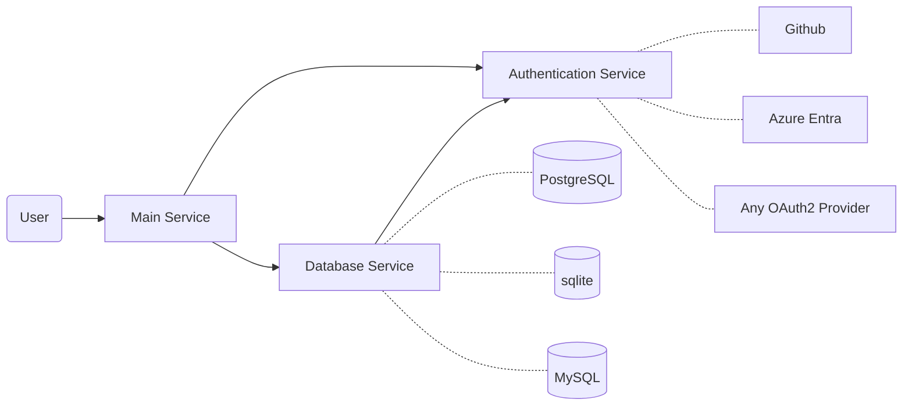

# System Design

Main service
- [apis](./api.md)
- many stateless replicas

User service
- oauth integration
- login/logout
- user creation, modification, etc.

Database service
- abstractions for different DBMS + database types
  - postgresql, mysql, sqlite

hash service
- generate short id for url from long url
  - id: group identifier (region), local identifier, random hash + incrementing counter
  - ex. cluster1-0-ijanek-0 or similar
  - base64 hash? nice for obfuscation, but not necessary maybe?
  revisit

